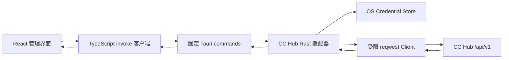

# 技术设计: CC Hub 管理控制台

## 技术方案

### 核心技术

- 前端继续使用现有 React 19、TypeScript、Vite 和 Vitest；不引入路由框架或通用组件库，三个主视图由应用壳中的受控标签状态切换。
- Tauri Rust 宿主新增 CC Hub 适配模块，以固定 `invoke` 命令调用上游 API；渲染层不执行到 CC Hub 的 `fetch`。
- Rust HTTP 使用支持 TLS 的 `reqwest`；管理员令牌通过适配 Windows Credential Manager 的操作系统凭据库保存；非敏感连接元数据保存在应用数据目录。
- 上游响应在 Rust 适配边界规范化成窄 DTO，再由 TypeScript 客户端和 React 视图消费。不会把任意上游 JSON、任意 URL 或任意 HTTP header 暴露为通用代理能力。

### 实施前契约核验门

知识库已确认端点和认证层级。2026-08-10 已在获授权测试实例执行只读核验并保存脱敏 fixture；provider 真实写入仍单列为 HITL 验证，不能因为 OpenAPI 字段存在而假定写入已被验证。

1. `GET /api/v1/health`：返回 200，`apiVersion` 为 `1.0.0`。
2. `GET /api/v1/openapi.json`：返回 200，确认相关 operation 的请求/响应 schema；目标实例不以 `ProviderUpdateSchema` 等特定 component 名称公开这些契约，代码只依赖已确认的 endpoint 字段。
3. `GET /api/v1/providers?include=statistics`：返回 200。item 有 `id:number`、`name:string`、`providerType:string`、`isEnabled:boolean`、`todayCallCount:number` 和 `statistics.todayCalls:number`；页面固定使用顶层 `todayCallCount`。
4. `PATCH /api/v1/providers/{id}`：OpenAPI 已确认最小启停请求 `{is_enabled:boolean}`、响应 `isEnabled:boolean` 与 `X-CCH-Operation-Id` / `X-CCH-Undo-Token` 头；尚未对真实 provider 发起 mutation，必须在获许可的非关键目标上另行核验。
5. `GET /api/v1/users`、`GET /api/v1/users/{id}/limit-usage:all`、`POST /api/v1/users:usageBatch`：均返回 200。额度桶为 `{usage:number,limit:number|null}`；有配置的 `limitTotal.limit` 与 `limitTotalUsd` 一致，`null` 表示未配置该项额度上限。batch 返回 `usageByKeyId` 的单 key 今日统计，不覆盖日/月/总桶，不能作为主数据源。
6. `GET /api/v1/usage-logs`、`GET /api/v1/usage-logs/filter-options`、`GET /api/v1/system/timezone`、`GET /api/v1/system/display-settings`：均返回 200。日志有数值稳定 `id`、`createdAt`，默认倒序；cursor 为 `cursorCreatedAt/cursorId/limit`，`startTime/endTime` 使用 Unix 毫秒，分页为 `pageInfo:{nextCursor,hasMore,limit}`；筛选选项为 `models/statusCodes/endpoints`。

契约夹具只含合成值，不含 token、key、实例 URL、真实用户名或原始错误详情。读取型页面的字段、类型、时间口径和分页语义已满足实现条件；provider PATCH 的线上可逆核验仍是独立 HITL 门。

### 上游端点映射

| 业务能力 | CC Hub v1 端点 | 权限 | 使用方式与约束 |
|---|---|---:|---|
| 连接健康 | `GET /api/v1/health` | public | 仅用于可达性，不代表管理员凭据有效。 |
| Schema 核验 | `GET /api/v1/openapi.json` | 运行时文档入口 | 仅在连接测试和开发夹具更新中使用，不作为日常页面请求。 |
| provider 列表 | `GET /api/v1/providers?q=&providerType=&include=statistics` | admin | `q` 和 `providerType` 走服务端；启用状态走本地二次过滤；今日调用固定映射顶层 `todayCallCount:number`。 |
| provider 启停 | `PATCH /api/v1/providers/{id}` | admin | 只发送已确认的 `{is_enabled:boolean}` 最小 patch，并以返回的 `isEnabled` 为准；不暴露创建、删除或批量操作。线上可逆核验待 HITL。 |
| 用户分页 | `GET /api/v1/users` | admin | 使用已确认的 `q`、`status`、`cursor`、`limit`，按 `items/pageInfo` 处理。 |
| 用户额度 | `GET /api/v1/users/{id}/limit-usage:all` | read | 正确性基线；返回 `limitDaily`、`limitMonthly`、`limitTotal` 等 `{usage:number,limit:number|null}` 桶，`null` 代表未配置上限。 |
| 用户额度批量优化 | `POST /api/v1/users:usageBatch` | admin | 目标实例仅返回 `usageByKeyId` 的单 key 今日统计，不覆盖五项额度桶；本实现不启用该优化，统一回退到受并发限制的逐用户读取。 |
| 服务端时区/显示 | `GET /api/v1/system/timezone`、`GET /api/v1/system/display-settings` | read | 目标实例返回 `timeZone`、`currencyDisplay`、`billingModelSource`；用于“今日”边界和成本单位展示，缺失时保守显示上游原始单位。 |
| 使用记录 | `GET /api/v1/usage-logs` | read | 仅传递已确认的 `cursorCreatedAt/cursorId/limit`、筛选项和毫秒 `startTime/endTime`；按 `pageInfo.nextCursor/hasMore` 请求，默认取目标实例按 `createdAt` 倒序的最新页。 |
| 使用记录筛选项 | `GET /api/v1/usage-logs/filter-options` | admin | 缓存目标实例返回的 `models`、`statusCodes`、`endpoints`；缺失集合按空选项处理，不假定某值域一定存在。 |

所有需要管理员可见范围的调用统一使用 `ADMIN_TOKEN` 作为 `Authorization: Bearer <token>`。Bearer 模式不需要 CC Hub 的 cookie CSRF token；普通用户 API key 不能替代管理员令牌。

## 架构设计



### Rust 宿主职责

新增 `src-tauri/src/cc_hub/`，建议拆分为 `config.rs`、`credentials.rs`、`client.rs`、`contracts.rs`、`commands.rs` 与 `mod.rs`：

- `config.rs` 只保存规范化的 base URL、配置版本、最近成功校验时间和传输安全确认状态。base URL 允许反向代理路径前缀，但拒绝 userinfo、query、fragment 和非 HTTP(S) scheme。
- `credentials.rs` 将固定服务名下的管理员令牌写入、读取和删除 OS credential store。`get_connection_state` 永远只返回 `hasToken` 和脱敏元数据，不能返回 token、token 长度或可重建 token 的片段。
- `client.rs` 用受限 URL 拼接和固定 endpoint 方法执行请求，默认拒绝无效 TLS、重定向到不同 origin 和未配置 host，并为每个请求设置固定超时。HTTPS 为默认；非 HTTPS 仅允许用户显式确认的本机或私有网络部署，且界面显示不安全连接状态。
- `contracts.rs` 将上游 JSON 严格解析为供应商、额度、日志等 DTO。必要字段不匹配时返回可诊断但脱敏的 `upstream_contract_mismatch`，而不是向前端转发原始 JSON。
- `commands.rs` 提供精确业务命令；`save_cc_hub_connection` 在写入元数据或 credential 前完成健康、管理员权限和必需能力校验。没有通用的 `http_request(url, headers, body)` 命令。所有错误映射为稳定错误类别和 CC Hub `errorCode`，不回传 RFC 9457 `detail`。

建议命令如下：

| Tauri 命令 | 输入 | 输出 | 副作用 |
|---|---|---|---|
| `get_cc_hub_connection_state` | 无 | 脱敏连接状态 | 无 |
| `save_cc_hub_connection` | `baseUrl`、`adminToken`、`allowInsecureHttp` | 脱敏连接状态 | 在 Rust 中先校验权限与必需能力，成功后才写本地元数据和 credential store |
| `test_cc_hub_connection` | 无 | API 版本、权限和能力结果 | 无 |
| `remove_cc_hub_connection` | 无 | 空成功结果 | 删除本地元数据和 credential |
| `list_providers` | `q`、`providerType`、`enabled` | `ProviderRow[]` | 无 |
| `set_provider_enabled` | `providerId`、`enabled` | `ProviderPatchResult { isEnabled }` | 上游单个 PATCH；仅在 `providerPatchRuntimeVerified` 为 true 时由 UI 开放 |
| `list_quota_users` | 用户筛选和 cursor | `QuotaUserPage` | 无 |
| `list_usage_logs` | 已验证的日志筛选和分页 | `UsageLogPage` | 无 |
| `get_usage_filter_options` | 无 | 可用筛选项 | 无 |

### 前端职责

新增 `src/features/cc-hub/`：

- `api.ts` 封装 `@tauri-apps/api/core` 的 `invoke`，把 Rust 错误转换为前端可呈现的错误类型，不缓存或记录 token。
- `types.ts` 和 `normalizers.ts` 维护窄 DTO、额度派生规则、日期/币种显示规则与稳定日志键；测试直接保护这些纯函数。
- `hooks/` 分别管理连接状态、provider 查询、用户额度页和 usage logs。每个 hook 都拥有请求序号、视图有效期与 loading/error/stale 状态；已开始的宿主请求通过结果失效而非由渲染层中止来处理。
- `components/` 提供应用壳、连接设置、供应商表、限额表和使用详情表。保持现有依赖简单；如加入 `lucide-react`，仅用于刷新、筛选和连接设置等工具型控件，并提供 aria label/tooltip。

应用以三个主标签呈现“供应商”“限额管理”“使用详情”。首次未配置连接时仅显示连接设置；已配置但无法验证时显示可重新编辑的连接状态。不会在 WebView 中将 base URL 加入 CSP `connect-src`，因为网络请求留在 Rust 宿主。

### 供应商页面行为

- 初始请求带 `include=statistics`；名称搜索经 250ms 防抖后传给 `q`，`providerType` 使用上游筛选，启用/停用状态作为本地筛选。
- 表格固定列为名称、类型、权重/优先级（仅在 schema 已确认时显示）、状态、今日调用次数和操作。无数据、字段缺失和错误分别呈现，不能显示为零。
- 开关为受控、行级 pending 的二元控件。单次切换不做多余确认；请求成功后以服务端返回 `isEnabled` 覆盖乐观状态，失败立即回滚。保留 operation ID 仅作内存诊断，不存储 token 或上游 key。
- `todayCallCount` 必须来自目标实例已确认的 provider 字段；`statistics.todayCalls` 仅作为同一响应的契约记录，不以日志页中当前加载条数替代。

### 限额管理页面行为

- 先取一页用户，默认 `limit=25`，再用最多 4 个并发的 `limit-usage:all` 请求填充额度；目标实例的 `users:usageBatch` 仅有按 key 的今日统计，明确不作为额度数据源。
- 当前页额度结果缓存 30 秒；手动刷新、筛选变化、分页变化和 provider/用户状态写操作后使相关缓存失效。
- 统一 DTO 为 `QuotaBucket { usage, limit, status }`。`total` 映射 `limitTotal`，`today` 映射 `limitDaily`，`month` 映射 `limitMonthly`；`remaining` 使用原始 `limit - usage` 判断状态，展示值下限为零。目标实例中 `limit:null` 已确认表示未配置上限，显示“不限”；字段缺失或类型不匹配显示“不可用”。
- 金额值按上游成本桶展示；使用 `/system/display-settings` 和 `/system/timezone` 确认单位、精度和计费日边界。额度页不提供修改、重置或删除入口。

### 使用详情页面行为

- 默认时间范围为由服务器 `timeZone` 计算的“今天”，请求按 `createdAt` 倒序的最新 cursor 页；筛选控件只显示已确认的 `providerId`、`userId`、`model`、`statusCode`、`endpoint` 与毫秒时间范围。
- 表格最少包含已确认的记录时间、provider、用户/密钥标识、模型、端点、状态和成本/Token 字段。某个非核心字段未由上游返回时隐藏该列，而非虚构值。
- 自动刷新默认开启，轮询间隔为 10 秒，只在该标签可见、页面处于最新页、窗口未隐藏且没有在途请求时执行。离开页面、切到历史页、改变筛选、手动刷新或组件卸载时使请求结果失效并停止后续调度；每个响应带本地请求序号，过期响应丢弃。宿主 HTTP 请求由固定超时约束，不假定前端可中止它。
- 刷新采用“替换当前最新页”而不是无限追加。使用上游稳定日志 ID；若 schema 未提供 ID，契约门必须定义可验证的组合键和重复记录策略，否则不启用自动刷新。

## 设计边界

- **范围内:** 单 CC Hub 连接、安全凭据处理、三个管理员视图及其必要的只读查询和 provider 单项启停。
- **范围外:** 浏览器直连 CC Hub、保存或显示明文 secret、任意网络代理、CC Hub 写入功能扩展、多个环境、Sub2API、日志导出和实时订阅。
- **模块职责:** Rust 负责凭据、URL 约束、HTTP、上游契约和错误脱敏；前端负责视图状态、交互、格式化和轮询生命周期；CC Hub 是唯一业务数据权威来源。
- **接口契约:** React 只依赖稳定 Tauri DTO；Rust 只调用固定 CC Hub endpoint。上游 schema 变化不得无声渗透到页面。
- **数据边界:** 本地持久化仅存 base URL 和连接元数据；令牌存在 OS credential store；日志、额度和 provider 数据仅内存/短期缓存，不建立本地业务数据库。
- **依赖边界:** 新增 Rust 网络/凭据/序列化依赖前核验 Windows 与 Rust 1.77.2 兼容性及许可证；前端不新增大型状态管理、路由或 UI 框架。`src-tauri/tauri.conf.json` 的 CSP 保持不放宽。
- **大型项目最小改动:** 当前项目规模很小，但仍只改造入口应用和新增 CC Hub feature/module，不重构 Tauri 配置、构建流程或无关 UI。

## 架构决策 ADR

### ADR-001: 使用 Tauri 宿主适配器而非 WebView 直连

**上下文:** CC Hub 管理 API 要求高权限 `ADMIN_TOKEN`；现有 CSP 仅允许 `self`，目标实例的 CORS 不确定。

**决策:** Rust 宿主使用固定业务命令和 HTTP 客户端访问 CC Hub，React 仅经 `invoke` 调用。

**理由:** 管理员令牌不进入 localStorage、sessionStorage 或浏览器网络层；无需放宽 CSP，也避免 CORS 和任意请求代理风险。

**替代方案:** WebView `fetch` + 动态 `connect-src` → 拒绝原因: 暴露 token、依赖 CORS、扩大 CSP 和前端攻击面。

**影响:** 需要新增 Rust 模块、依赖和跨语言 DTO 测试，但获得明确的安全边界。

**状态:** 已采纳

### ADR-002: 以逐用户 `limit-usage:all` 为额度正确性基线

**上下文:** `users:usageBatch` 存在但响应 schema 尚未确认；页面要求同时展示总、日、月额度与剩余值。

**决策:** 先以 `GET /api/v1/users/{id}/limit-usage:all` 作为正确性基线，批量接口仅在契约核验显示其覆盖全部必需桶后作为优化启用。

**理由:** 避免因假设批量返回格式或统计口径而显示错误额度；最多 4 并发和 25 条默认页大小可控制上游负载。

**替代方案:** 直接假定批量接口可用 → 拒绝原因: 文档未确认响应字段；每页无界并发请求 → 拒绝原因: 会对 CC Hub 造成突发压力。

**影响:** 首次加载可能比理想批量调用慢，但结果可解释且优化路径清晰。

**状态:** 已采纳

### ADR-003: 使用可见性受控轮询而非实时订阅

**上下文:** 文档没有 usage logs 的 SSE/WebSocket 增量订阅；用户需要定时获取当前使用记录。

**决策:** 最新页以 10 秒轮询刷新，结合窗口可见性、请求序号、结果失效、固定宿主超时和无重叠约束。

**理由:** 使用已确认的 REST API 即可满足需求，且不会实现未记录的实时协议。

**替代方案:** 自建 WebSocket/SSE 代理 → 拒绝原因: 上游无对应 API，增加服务和状态一致性复杂度。

**影响:** 最多 10 秒的新数据可见延迟；历史页不自动刷新。

**状态:** 已采纳

## 数据模型

```text
LocalConnectionMeta
  baseUrl: string
  configuredAt: ISO-8601
  lastValidatedAt?: ISO-8601
  transportSecurity: secure | acknowledged-insecure
  capabilities: { providerTodayCalls, providerPatch, providerPatchRuntimeVerified, usageLogs, usageLogStableId }

ProviderRow
  id: number | string
  name: string
  providerType: string
  isEnabled: boolean
  todayCalls: number
  optionalDisplayFields: { weight?, priority?, maskedUrl? }

QuotaUserRow
  user: { id, name, status?, tags? }
  total: QuotaBucket
  today: QuotaBucket
  month: QuotaBucket
  remaining: { value?: number, status: limited | unlimited | unavailable | exceeded }

UsageLogRow
  id: string
  occurredAt: ISO-8601
  providerId?: string | number
  providerName?: string
  userName?: string
  keyName?: string
  model?: string
  endpoint?: string
  statusCode?: number
  inputTokens?: number
  outputTokens?: number
  cost?: number
```

`todayCalls`、`UsageLogRow` 的字段名和 `QuotaBucket.status` 的无限额判定必须在契约核验后落实为具体代码，不得依据本提案中的抽象名称直接猜测上游字段。

## 安全与性能

- **安全:** 不在前端状态、日志、错误、fixture、截图或文档中保留管理员令牌；Rust command 只接受已定义输入；URL 规范化后只访问已配置 origin 的固定相对路径；不禁用 TLS 校验；对 RFC 9457 错误只传递本地化所需的 `status`、`errorCode` 和安全类别；单个 provider 开关成功后以服务端状态校验。
- **性能:** provider 请求可按用户手动刷新；额度页默认 25 行、最多 4 并发、30 秒短缓存；使用详情仅最新页 10 秒轮询、不可见时停止后续调度、在途请求不叠加且过期结果被丢弃；所有宿主 HTTP 请求均有固定超时；名称映射复用已加载数据，避免日志行 N+1 请求。

## 测试与部署

- **测试:** 新增可观察行为按 TDD 执行。Rust 测试覆盖 URL 限制、令牌不泄露、固定路径、认证头、RFC 9457 错误映射和 DTO contract fixture；Vitest/Testing Library 覆盖连接状态、provider 筛选/启停回滚、额度派生、无限额/未知/超额状态、日志轮询的结果失效与过期响应丢弃。使用脱敏的 CC Hub OpenAPI/响应 fixture，不连真实生产数据运行单元测试。
- **部署:** 先运行 `npm test`、`npm run lint`、`npm run build`、`cargo test --manifest-path src-tauri/Cargo.toml` 和 `cargo check --manifest-path src-tauri/Cargo.toml`。随后由持有测试 CC Hub 管理凭据的人员在 Windows 上用 `npm run tauri:dev` 完成连接、provider 开关、额度页和轮询手工验收；Windows CI 打包继续验证 `npm run tauri:build`。不在 CI 注入真实管理员令牌。
